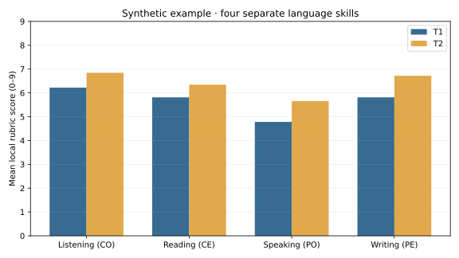

# Synthetic FLE learning evidence

**Demonstration only.** Every identifier and score was algorithmically generated. These are local rubric scores out of 9, not CEFR levels or observations of actual pupils.

## Cohort means by skill

| Skill | T1 / 9 | T2 / 9 | Change |
|---|---:|---:|---:|
| Listening (CO) | 6.22 | 6.84 | +0.62 |
| Reading (CE) | 5.81 | 6.34 | +0.53 |
| Speaking (PO) | 4.78 | 5.66 | +0.88 |
| Writing (PE) | 5.81 | 6.72 | +0.91 |

Each period has 128 skill observations across 32 synthetic learners. Each skill has 32 observations per period.

## Grade-level descriptive view

| Grade | Skill | T1 / 9 | T2 / 9 | Change |
|---:|---|---:|---:|---:|
| 2 | Reading (CE) | 4.88 | 5.38 | +0.50 |
| 2 | Listening (CO) | 5.50 | 6.12 | +0.62 |
| 2 | Writing (PE) | 5.12 | 6.25 | +1.12 |
| 2 | Speaking (PO) | 4.88 | 5.88 | +1.00 |
| 3 | Reading (CE) | 5.50 | 6.12 | +0.62 |
| 3 | Listening (CO) | 5.75 | 6.62 | +0.88 |
| 3 | Writing (PE) | 5.88 | 6.50 | +0.62 |
| 3 | Speaking (PO) | 4.62 | 5.25 | +0.62 |
| 4 | Reading (CE) | 6.12 | 6.75 | +0.62 |
| 4 | Listening (CO) | 7.12 | 7.62 | +0.50 |
| 4 | Writing (PE) | 6.62 | 7.62 | +1.00 |
| 4 | Speaking (PO) | 4.88 | 5.50 | +0.62 |
| 5 | Reading (CE) | 6.75 | 7.12 | +0.38 |
| 5 | Listening (CO) | 6.50 | 7.00 | +0.50 |
| 5 | Writing (PE) | 5.62 | 6.50 | +0.88 |
| 5 | Speaking (PO) | 4.75 | 6.00 | +1.25 |

## Instructional interpretation

The largest modeled mean gain is Writing (PE) (+0.91); the smallest is Reading (CE) (+0.53). These patterns are imposed by the simulation and cannot establish that an intervention worked.
Use the table to rehearse a decision cycle: inspect item-level work, choose a targeted task, offer feedback, and reassess the same skill with a fresh prompt. Small synthetic groups and local ordinal scores do not justify inferential claims.

## Safeguards

- Never replace the synthetic CSV with pupil data in this public repository.
- Keep four skills separate; no overall CEFR label or ranking of individual children.
- Scores with differing support conditions need careful interpretation; the support field is retained for that discussion.
- Reassess a missing task rather than assigning zero; this sample contains no missing observations.
